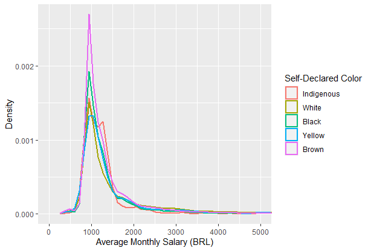
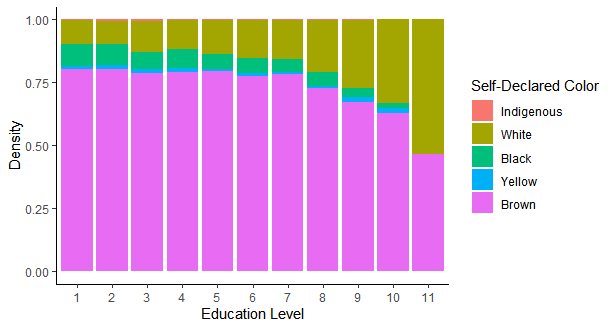
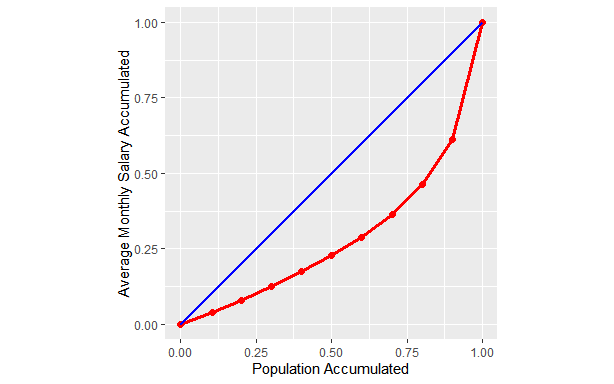

# FerreiraEnzoA
:computer: Problem solver and data-driven professional  
:email: Email: <a href="mailto:FerreiraEnzoA@gmail.com">FerreiraEnzoA@gmail.com</a>  
:briefcase: LinkedIn: [FerreiraEnzoA](https://www.linkedin.com/in/ferreiraenzoa/)      

:point_right: <a href="/Portfolio">MAIN PAGE</a> || <a href="/Portfolio/Archive">ARCHIVE</a> || <a href="/Portfolio/About">ABOUT</a> :point_left:

     

#  Project 1: Piauí Economic Analysis  
This project was inspired by an academic work required by Economic Analysis Methods discipline (CE242) of Economics major at University of Campinas (Brazil). Its purpose isn’t to analyze scientifically, but it goal is only to make this code open-source to further analysis.

Special thanks to Bruno Negreiros for coding with me and Professor Ivette Luna for mentoring us in CE242.

You can both get the [source code](https://github.com/FerreiraEnzoA/Portfolio/tree/main/Proj1) and see the analysis images.

