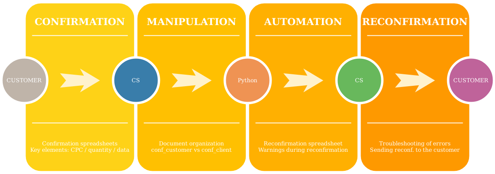
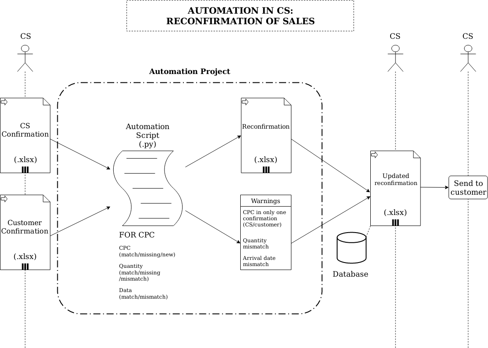

# FerreiraEnzoA
:computer: Problem solver and data-driven professional  
:email: Email: <a href="mailto:FerreiraEnzoA@gmail.com">FerreiraEnzoA@gmail.com</a>  
:briefcase: LinkedIn: [FerreiraEnzoA](https://www.linkedin.com/in/ferreiraenzoa/)      

:point_right: <a href="/Portfolio">MAIN PAGE</a> || <a href="/Portfolio/Archive">ARCHIVE</a> || <a href="/Portfolio/About">ABOUT</a> :point_left:

     

:page_with_curl: This repository is licensed under the terms of the [GPLv3 license](https://github.com/FerreiraEnzoA/Portfolio/blob/main/LICENSE).  

#  Project 2: Automation of Reconfirmation  
This project was inspired by difficulties in reconfirming a company's sales to a specific customer, as the task took hours to complete. In this context, the aim is to reduce both the reconfirmation time and the possible human errors in the analysis of extensive spreadsheets as much as possible.

The Customer Service sends a confirmation `conf_cs.xlsx` to the customer, then the customer replies with his own confirmation `conf_customer.xlsx`, so an analysis of correspondence or non-correspondence between these documents is necessary. In this way, this automation project proposes to analyze both (partially, since the final sales decisions with the necessary corrections depend on the Customer Service), generate a file for a possible reconfirmation `reconfirmation.xlsx` and indicate the warnings (items/quantity/arrival date) as output. CPC stands for Customer Product Code.

Primarily, I used the pandas library to manipulate structured data and, secondarily, the openpyxl library to read/write Excel 2010 .xlsx files.

You can get the [source code](https://github.com/FerreiraEnzoA/Portfolio/tree/main/Proj2) and solve any [issues](https://github.com/FerreiraEnzoA/Portfolio/issues).
