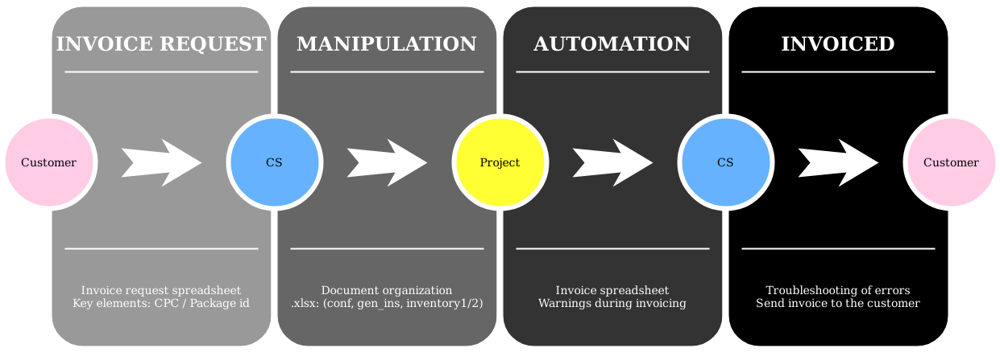
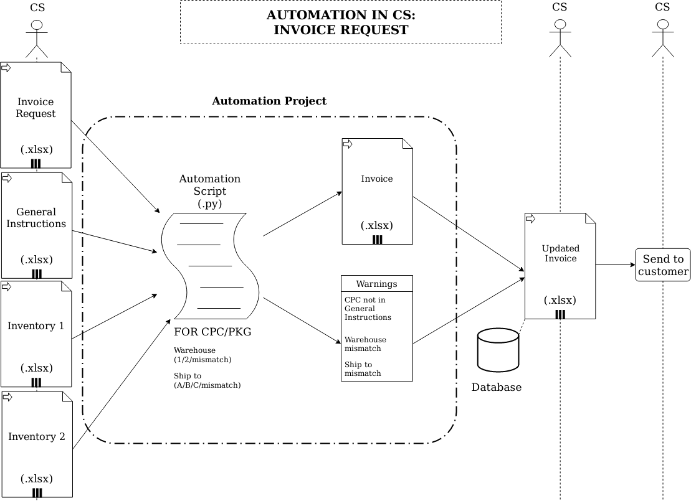

# FerreiraEnzoA
:computer: Problem solver and data-driven professional  
:email: Email: <a href="mailto:FerreiraEnzoA@gmail.com">FerreiraEnzoA@gmail.com</a>  
:briefcase: LinkedIn: [FerreiraEnzoA](https://www.linkedin.com/in/ferreiraenzoa/)      

:point_right: <a href="/Portfolio">MAIN PAGE</a> || <a href="/Portfolio/Archive">ARCHIVE</a> || <a href="/Portfolio/About">ABOUT</a> :point_left:

     

:page_with_curl: This repository is licensed under the terms of the [GPLv3 license](https://github.com/FerreiraEnzoA/Portfolio/blob/main/LICENSE).  

#  Project 3: Automation of Invoice  
This project was inspired by the difficulties in categorizing which of the two warehouses of a company certain merchandise requested by the customer and to which of its three locations it should be invoiced. In this context, the aim is to reduce both the categorization time and the possible human errors in spreadsheets as much as possible.

After sending a merchandise from a company's inventory to the customer's specific location, it is necessary to invoice the order of the order, according to the places of departure and destination. Therefore, the automation of descriptive categorization would greatly optimize this process.

The Customer Service team from a company receives his customer invoice request, which sends the document `conf.xlsx` containing the number Purchase Order `P/O #`, the item code to be invoiced `Item #`, its description 'Description', its quantity `Qty`, its package number `Lot #/Pallet #`, its transportation code `Shpmnt #`, and its purchasing closed date `Closed Date`.

The program compares (with `gen_ins.xlsx`) where each `Item #` of the customer (in `conf.xlsx`) is stored in the company (warehouse 1 or warehouse 2) according to the first 4 numbers of it. Then the `Lot # / Pallet #` of `conf.xlsx` are compared with `Package id` (which has the same meaning) of the spreadsheets `inventory1.xlsx` and `inventory2.xlsx`. Since destination is the same location invoice, here it can be used as synonyms. If the package is in inventory 1, it must ship to city ‘A’. However, if it is in the inventory 2, the name of the goods 'CustProdName' is verified, and if it is equal to 22 or it has ‘B’ in the name it should ship to city ‘B’, otherwise it should ship to city ‘C’. `CPC` stands for Customer Product Code.

Finally, the software generates a new spreadsheet `invoice.xlsx`, containing as header the same `P/O #`, `Item #`, `Description`, `Qty`, `Lot #/Pallet #`, `Shpmnt #`, `Closed Date` of `conf.xlsx`, in addition to the addition of `Wh`, `Ship to`, `Order`, and `Invoice`. `Order`, and `Invoice` are maintained blank spaces, as it will need action of the Customer Service team. `Wh` are filled automatically by 1, 2 or ‘?’ (if mismatch), and `Ship to` by ‘A’, ‘B’, ‘C’, or ‘?’ (if mismatch).

Primarily, I used the pandas library to manipulate structured data and, secondarily, openpyxl library to read/write Excel 2010 .xlsx files.

You can get the [source code](https://github.com/FerreiraEnzoA/Portfolio/tree/main/Proj3) and solve any [issues](https://github.com/FerreiraEnzoA/Portfolio/issues).
